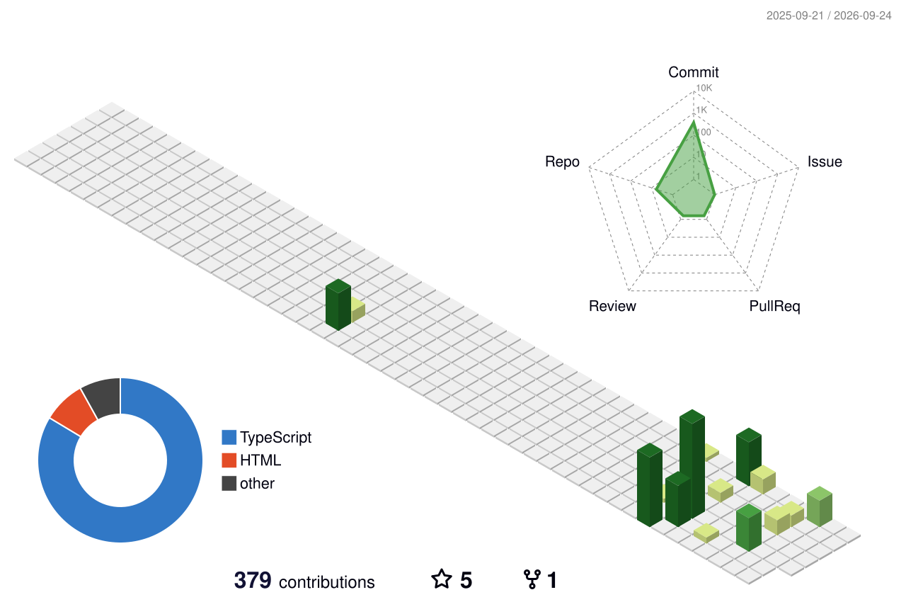
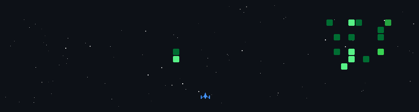

# 💫 About Me:
🔭 I’m currently learning Kubernetes • Terraform • GitHub Actions • AWS DevOps Practices • CI/CD  💬 Ask me about DevOps • Docker • Linux • AWS • Kubernetes • Terraform • CI/CD  ⚡ Fun fact I can spend hours automating a task that takes five minutes manually.

## 📊 3D Contribution Graph:

## 🌐 Socials:
   

## 🚀 Contribution Space Shooter:

# 💻 Tech Stack:
                
# 📊 GitHub Stats:
 
 

### ✍️ Random Dev Quote

---

<!-- Proudly created with GPRM ( https://gprm.itsvg.in ) -->
